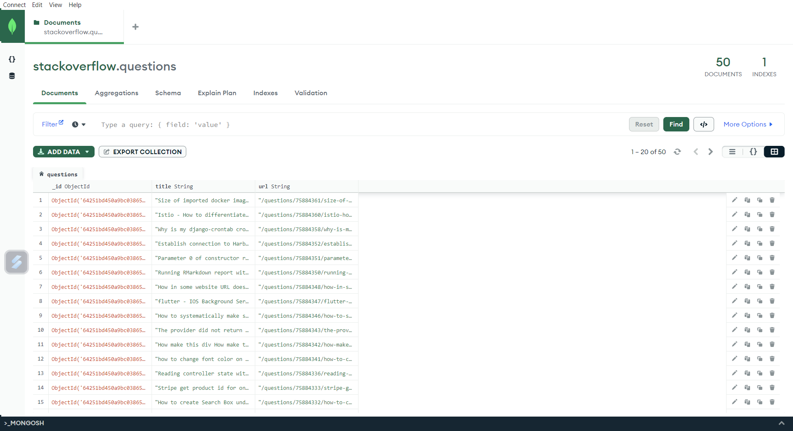

# Stack Overflow Scraping with Scrapy and MongoDB

This is a Python web scraping project which scrape Stack Overflow new questions using Scrapy and store it in MongoDB.

## Getting Started

- __Scrappy__: an open source and collaborative framework for extracting the data from websites.

- __PyMongo__: a Python distribution containing tools for working with MongoDB.

- __Stack Overflow__: an online community for developers to learn, share their programming language, etc.

- __MongoDB__: a document database (NoSQL) used to build highly available and scalable internet applications.

### Prerequisites
- [MongoDB Shell](https://downloads.mongodb.com/compass/mongosh-1.9.1-win32-x64.zip)
- [MongoDB Server](https://fastdl.mongodb.org/windows/mongodb-windows-x86_64-6.0.6-signed.msi)

### Installing

1. Import environment.yml
   ```
   conda env create -f environment.yml
   ```
2. Scrape the web
   ```
   scrapy crawl stack
   ```

### Result

I create a new database name `stackoverflow` to store the scraping result. 


### Documentation

- [MongoDB](https://www.mongodb.com)
- [PyMongo](https://pymongo.readthedocs.io/en/stable/)
- [Scrappy](https://scrapy.org)
- [Stack Overflow](https://stackoverflow.com)
- [Web Scraping with Scrapy and MongoDB](https://realpython.com/web-scraping-with-scrapy-and-mongodb/#pymongo)
